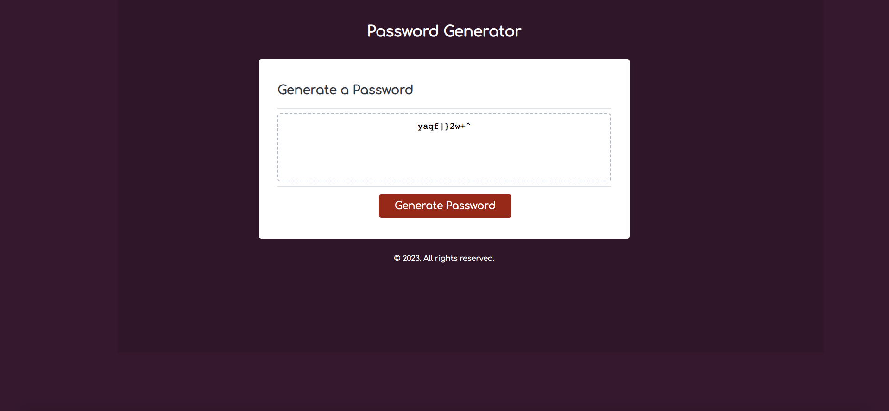

# Password Generator

## A simple password generator, interacting with the html elements, and collecting user inputs from a series of validated prompts

### Deployment / Code Repository

[Live deployment](https://tweetingcynical.github.io/password-generator/)

[Repository](https://github.com/TweetingCynical/password-generator)

### Scope and Purpose

Build a password generator which asks the user how many characters they would like to include, and the type of those characters.

### Installation

N/A

### Pseudocode

Steps to achieving the working generator:

* Declare variables needed for the process:
  - Different character types;
  - Password length choice;
  - Booleans for included character types;
* User confirm messages to get character type selection;
  - Check that user has made at least one choice;
* Concat the character type choices into one array;
* Function to handle producing a random number between two ints x and y inclusive;
* While newPassword < passwordLenChoice, choose random from concat, add to newPassword string;
* Display password in passwordText textbox in html

### Overview of Build

Some of the key JavaScript skills being utilised:
- Use of an array to store the hand history;
- Use of functions to store steps in code;
- Use of IsNaN and parseInt to ensure user inputs a number:

    ```javascript
    const passLenStr = prompt('How long would you like your passphrase? Enter a number between 10 and 64');
    // Convert user input to integer
    passLenOpt = parseInt(passLenStr);
    // Error message if input was not an integer
    if (isNaN(passLenOpt)) {
        alert('Invalid input. Please enter a number.');
    }
    ```

- Use of single and multiple arguments passed through function to limit amount of code used to create password;

    ```javascript
    let choiceOpt = getCharChoices();
    // 3. Combine correct character choices into new array
    charSelect = createNewArray(choiceOpt);
    // 4. Fill userPassword with for loop of random characters from step 3, until password length is reached
    userPassword = getRandom(charSelect, passLenOptInput);
    ```

- Use of Math.floor() and Maths.random() inside for loop for selecting random elements from charSelect to fill userPassword string with passLenOptInput length:
    
    ```javascript
    function getRandom(charSelect, passLenOptInput) {
      // Choose random characters from charSelect until passLenOptInput is filled with the correct number
      for(i = 0; i < passLenOptInput; i++) {
        let addChar = Math.floor(Math.random() * (charSelect.length));
        userPassword += charSelect[addChar];
      }
      return userPassword;
    }
    ```

- Use of .concat.apply to create one single array (charSelect) from nested array (charOptions):

    ```javascript
    // Arrange the array of arrays into one single array
    charSelect = [].concat.apply([], charOptions);
    return charSelect;
    ```

- Write password code block to run all the functions in the correct order;
- Reset options so that the user can generate a new password without refreshing the page.

## Suggested future changes

- Add checkboxes to html page so that user can select their options without using alerts, prompts and confirm;
- ✅ ~~Add a reset code block so new passwords can be generated without refreshing the page;~~
- Add code for when cancel button is selected on initial prompt for password length;

## Screenshot

Working version of site should look like this at standard screen size:


## License

MIT License

Copyright (c) 2022 TweetingCynical

Permission is hereby granted, free of charge, to any person obtaining a copy of this software and associated documentation files (the "Software"), to deal in the Software without restriction, including without limitation the rights to use, copy, modify, merge, publish, distribute, sublicense, and/or sell copies of the Software, and to permit persons to whom the Software is furnished to do so, subject to the following conditions:

The above copyright notice and this permission notice shall be included in all copies or substantial portions of the Software.

THE SOFTWARE IS PROVIDED "AS IS", WITHOUT WARRANTY OF ANY KIND, EXPRESS OR IMPLIED, INCLUDING BUT NOT LIMITED TO THE WARRANTIES OF MERCHANTABILITY, FITNESS FOR A PARTICULAR PURPOSE AND NONINFRINGEMENT. IN NO EVENT SHALL THE AUTHORS OR COPYRIGHT HOLDERS BE LIABLE FOR ANY CLAIM, DAMAGES OR OTHER LIABILITY, WHETHER IN AN ACTION OF CONTRACT, TORT OR OTHERWISE, ARISING FROM, OUT OF OR IN CONNECTION WITH THE SOFTWARE OR THE USE OR OTHER DEALINGS IN THE SOFTWARE.
